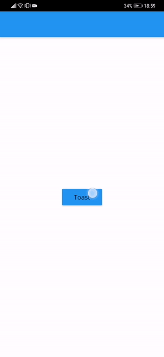
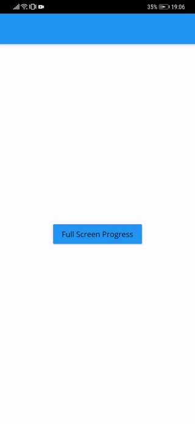

# Flutter Utils
Storage for Flutter utils that we are using for a development inside Star

## Architecture
Package with all tools that we are using to build architecture

### Bloc
Light-weight solution for implementing BLoC pattern. It provides a wrapper for a `StreamBuilder` to reduce boiler-plate code writing and Bloc class, where all business logic is implemented. This bloc caches states and will not trigger View in case of updating state with the same value (that is why each state extends from `Equatable` and must implement it).
[Here you can find an example of usage](https://github.com/star-flutter/utils/blob/master/architecture/bloc/example/bloc_example_widget.dart)

## Extensions
Package for our extensions to simplify and speed-up development

### UI Extensions
Solution to simplify a life working with design in Zeplin, where all values are provided in `dp` (or `pt`). This extension will help you write responsive UI according to design.
Example of usage: `height: 24.fromDp()` 

## Widgets
List of widgets, you can reuse in your project.

### Toast
Light-weight solution for Toast messages with a simple animation. It has two durations: short one and long one, and has an abbility to be shown in there different screen positions: bottom, center, top.

### Full Screen Progress
Overlay that will show a darkened background with a progress above your screen (without adding to widgets tree).

### Progress Button
Simple button, that animates after a user taps. Could be used as a non-blocking progress animation.

